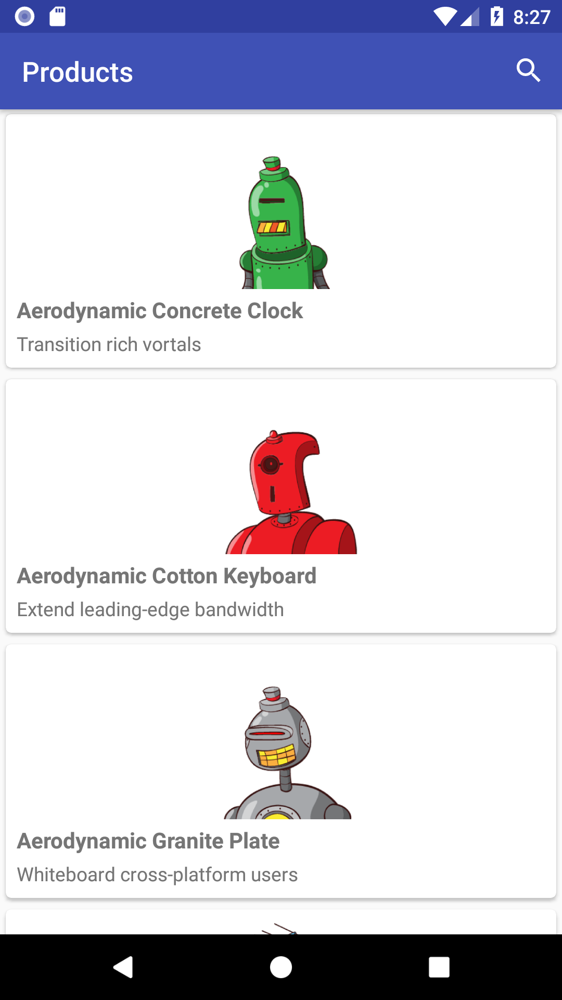
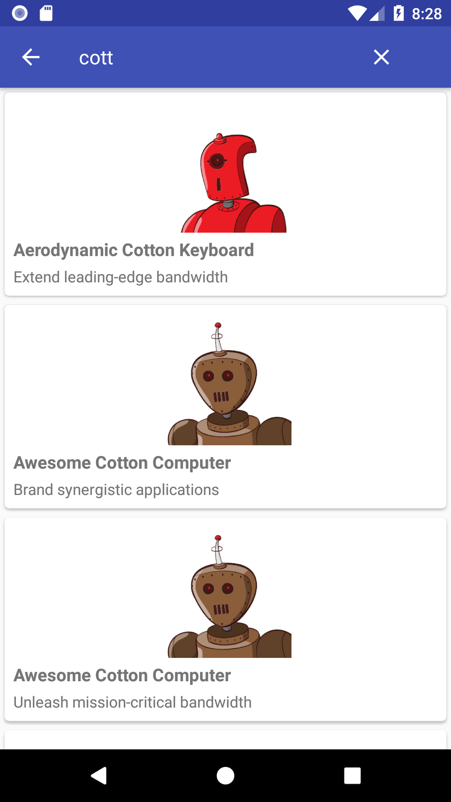
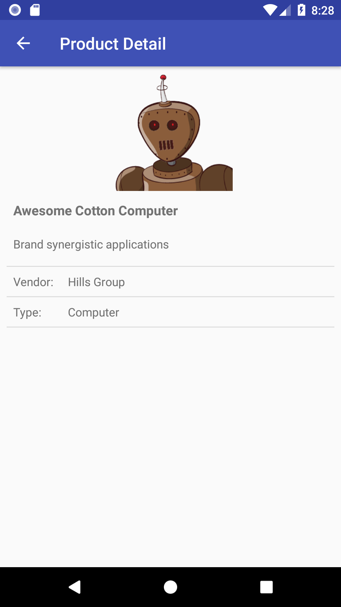

# About

Hello Shopify recruiter!

The app lists Shopify products, allows filtering them and shows the product details as outlined [here](https://docs.google.com/document/d/1_GEUDvlfoMfuLhzthw_ueaet4THOhnC-rADBs_4Lf44/edit).

Main Libraries used:
* Kotlin (it's what all the cool kids use these days)
* Retrofit2
* RxJava2 (easier to extend the app)
* Glide (for image loading)
* Android Livedata (so I don't have to deal with messy activity lifecycle)

<a href="https://github.com/DanSirbu/Shopify_Challenge_App/raw/master/app/build/outputs/apk/debug/app-debug.apk">Download Debug Build</a>

# Video
<a href="screenshots/screen_recording.mp4">Download</a>

# Screenshots

